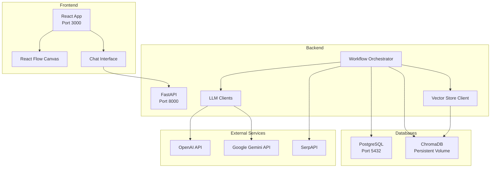

# No-Code/Low-Code Intelligent Workflow Builder

A full-stack web application that enables users to visually create and interact with intelligent workflows. Build workflows that handle user input, extract knowledge from documents, interact with language models, and return answers through an intuitive chat interface.


## 📋 Table of Contents

- [Tech Stack](#tech-stack)
- [Features](#features)
- [Quick Start](#quick-start)
- [Detailed Setup](#detailed-setup)
- [Architecture](#architecture)
- [API Documentation](#api-documentation)
- [Component Guide](#component-guide)
- [Deployment](#deployment)
- [Troubleshooting](#troubleshooting)

## 🛠 Tech Stack

### Frontend
- **React.js** - UI framework
- **React Flow** - Visual workflow builder
- **TailwindCSS** - Styling
- **Lucide React** - Icons

### Backend
- **FastAPI** - High-performance Python web framework
- **PostgreSQL** - Relational database for metadata and logs
- **ChromaDB** - Vector database for embeddings
- **SQLAlchemy** - ORM for database operations

### AI & Tools
- **OpenAI GPT** - Language model (gpt-3.5-turbo, gpt-4)
- **Google Gemini** - Alternative LLM (gemini-1.5-flash, gemini-1.5-pro)
- **OpenAI Embeddings** - Text embeddings (text-embedding-3-large/small)
- **SerpAPI** - Web search integration
- **PyMuPDF** - PDF text extraction

### DevOps
- **Docker & Docker Compose** - Containerization
- **Kubernetes (Optional)** - Orchestration
- **Nginx** - Frontend server

## ✨ Features

### Core Features
- ✅ **Visual Workflow Builder** - Drag-and-drop interface using React Flow
- ✅ **4 Component Types** - User Query, Knowledge Base, LLM Engine, Output
- ✅ **Document Upload & Processing** - PDF text extraction and embedding generation
- ✅ **Vector Search** - Semantic search using ChromaDB
- ✅ **Multiple LLM Support** - OpenAI GPT and Google Gemini
- ✅ **Web Search Integration** - Real-time information via SerpAPI
- ✅ **Interactive Chat Interface** - Test workflows with conversational UI
- ✅ **Persistent Storage** - PostgreSQL for metadata, ChromaDB for vectors
- ✅ **Workflow Validation** - Ensures valid component connections
- ✅ **Chat History** - Stored in PostgreSQL for reference

### Additional Features
- 🎨 Modern, responsive UI with dark mode support
- 🔄 Real-time workflow execution
- 📊 Structured logging for debugging
- 🔒 CORS-enabled for secure cross-origin requests
- 🐳 Fully Dockerized for easy deployment
- 📝 Comprehensive API documentation (Swagger/OpenAPI)

## 🚀 Quick Start

### Automated Setup (Recommended)

```bash
# 1. Clone the repository
git clone <your-repo-url>
cd aiplanet

# 2. Run setup script
./setup.sh
```

The script will:
- Create `.env` file from template
- Build Docker images
- Start all services
- Run health checks

**Access the application:**
- Frontend: http://localhost:3000
- API Docs: http://localhost:8000/api/docs
- PostgreSQL: localhost:5432

## 📖 Detailed Setup

### Prerequisites

1. **Docker & Docker Compose**
   ```bash
   docker --version  # Should be 20.10+
   docker-compose --version  # Should be 1.29+
   ```

2. **API Keys** (Required)
   - [OpenAI API Key](https://platform.openai.com/api-keys)
   - [SerpAPI Key](https://serpapi.com/manage-api-key)
   - [Google Gemini API Key](https://makersuite.google.com/app/apikey) (Optional)

### Manual Setup

#### 1. Environment Configuration

Create `backend/.env` file:

```bash
# Copy template
cp backend/.env.example backend/.env

# Edit with your API keys
nano backend/.env
```

**Required variables:**
```env
OPENAI_API_KEY=sk-...
SERPAPI_API_KEY=...
GEMINI_API_KEY=...  # Optional

# Database (default for Docker)
DATABASE_URL=postgresql://user:password@db:5432/dbname

# ChromaDB (optional, defaults to ./chroma_data)
CHROMA_PERSIST_DIRECTORY=/app/chroma_data
```

#### 2. Start Services

```bash
# Build and start all services
docker-compose up --build

# Or run in detached mode
docker-compose up -d

# View logs
docker-compose logs -f

# Stop services
docker-compose down
```

#### 3. Verify Installation

Check service health:
```bash
# Backend health
curl http://localhost:8000/api/docs

# Database connection
docker-compose exec db psql -U user -d dbname -c "SELECT 1;"

# Frontend
curl http://localhost:3000
```

## 🏗 Architecture



### Data Flow

1. **User builds workflow** in React Flow canvas
2. **User initiates chat** and sends query
3. **Frontend** sends workflow definition + query to backend
4. **Workflow Orchestrator** processes components sequentially:
   - User Query → extracts query
   - Knowledge Base → searches vectors, retrieves context
   - LLM Engine → combines query + context + web search, calls LLM
   - Output → returns response to user
5. **Response displayed** in chat interface
6. **Workflow execution logged** to PostgreSQL

## 📚 API Documentation

### Endpoints

#### Workflow Execution
```http
POST /api/workflow/run
Content-Type: application/json

{
  "query": "What is machine learning?",
  "definition": [
    {"id": "1", "type": "user_query", "config": {}},
    {"id": "2", "type": "llm_engine", "config": {"llm_provider": "openai", "model": "gpt-3.5-turbo"}},
    {"id": "3", "type": "output", "config": {}}
  ]
}
```

#### Document Upload
```http
POST /api/knowledge_base/upload
Content-Type: multipart/form-data

files: [file1.pdf, file2.pdf]
embedding_provider: openai
```

#### Interactive API Docs
Visit http://localhost:8000/api/docs for Swagger UI with:
- All endpoints documented
- Try-it-out functionality
- Request/response schemas

## 🧩 Component Guide

### 1. User Query Component
- **Purpose:** Entry point for user input
- **Inputs:** None (accepts query from chat)
- **Outputs:** Query text
- **Configuration:** None required

### 2. Knowledge Base Component
- **Purpose:** Retrieve relevant context from documents
- **Inputs:** User query
- **Outputs:** Retrieved context
- **Configuration:**
  - Upload PDF files
  - Select embedding model (text-embedding-3-large/small)
  - Number of results to retrieve

### 3. LLM Engine Component
- **Purpose:** Generate AI responses
- **Inputs:** Query, optional context, optional custom prompt
- **Outputs:** AI-generated response
- **Configuration:**
  - LLM Provider (OpenAI/Gemini)
  - Model selection
  - Custom system prompt
  - Enable/disable web search

### 4. Output Component
- **Purpose:** Display results to user
- **Inputs:** LLM response
- **Outputs:** Chat message
- **Configuration:** None required

### Example Workflows

**Simple Q&A:**
```
User Query → LLM Engine → Output
```

**RAG (Retrieval Augmented Generation):**
```
User Query → Knowledge Base → LLM Engine → Output
```

**Web-Enhanced RAG:**
```
User Query → Knowledge Base → LLM Engine (with SerpAPI) → Output
```

## 🚢 Deployment

### Docker Compose (Production)

```bash
# Build production images
docker-compose -f docker-compose.yml build

# Deploy with environment variables
docker-compose up -d

# Scale backend if needed
docker-compose up -d --scale backend=3
```

### Kubernetes (Optional)

See `k8s/` directory for manifests:

```bash
# Apply all manifests
kubectl apply -f k8s/

# Check deployment
kubectl get pods
kubectl get services

# Access via NodePort or LoadBalancer
kubectl get service frontend-service
```

### Environment Variables for Production

```env
# Use strong passwords
POSTGRES_PASSWORD=<strong-random-password>

# Production database URL
DATABASE_URL=postgresql://user:<password>@postgres-service:5432/dbname

# API keys from secrets management
OPENAI_API_KEY=${OPENAI_KEY_SECRET}
```

## 🔧 Troubleshooting

### Backend Issues

**Problem:** `ModuleNotFoundError: No module named 'app'`
```bash
# Rebuild backend
docker-compose build backend
docker-compose up -d backend
```

**Problem:** Database connection error
```bash
# Check database is running
docker-compose ps db

# Check logs
docker-compose logs db

# Reset database
docker-compose down -v
docker-compose up -d
```

### Frontend Issues

**Problem:** Cannot connect to backend
- Verify backend is running: `curl http://localhost:8000/api/docs`
- Check CORS configuration in `backend/app/main.py`
- Ensure `proxy` in `frontend/package.json` is set

**Problem:** Build fails
```bash
# Clear node modules and rebuild
docker-compose down
docker-compose build --no-cache frontend
docker-compose up -d
```

### ChromaDB Issues

**Problem:** Embeddings not persisting
- Check volume mount in `docker-compose.yml`
- Verify `CHROMA_PERSIST_DIRECTORY` in `.env`
- Check permissions: `docker-compose exec backend ls -la /app/chroma_data`

### API Key Issues

**Problem:** `401 Unauthorized` from OpenAI/Gemini
- Verify API key is correct in `.env`
- Check key has proper permissions/credits
- Restart backend: `docker-compose restart backend`

### Logs

```bash
# All services
docker-compose logs -f

# Specific service
docker-compose logs -f backend

# Last 100 lines
docker-compose logs --tail=100 backend
```

## 📝 Development

### Local Development (Without Docker)

#### Backend
```bash
cd backend
python -m venv venv
source venv/bin/activate  # Windows: venv\Scripts\activate
pip install -r requirements.txt

# Create .env file
cp .env.example .env

# Run server
uvicorn app.main:app --reload --host 0.0.0.0 --port 8000
```

#### Frontend
```bash
cd frontend
npm install
npm start  # Starts on port 3000
```

### Testing

```bash
# Backend tests
cd backend
pytest

# Frontend tests
cd frontend
npm test
```

## 📄 License

MIT License - see LICENSE file for details

## 🤝 Contributing

Contributions are welcome! Please:
1. Fork the repository
2. Create a feature branch
3. Make your changes
4. Submit a pull request

## 📧 Support

For issues and questions:
- Create an issue on GitHub
- Check existing documentation
- Review API docs at `/api/docs`

---

**Built with ❤️ for AI-powered workflow automation**
# aiplanet
