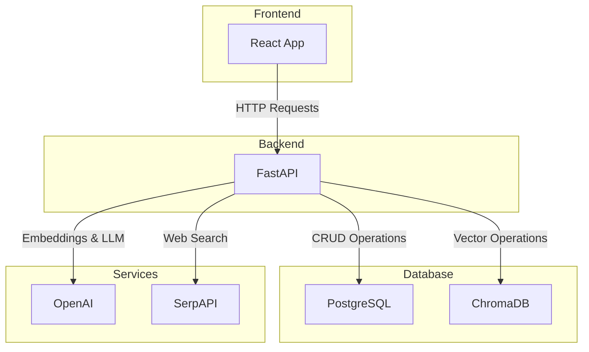

```mermaid
graph TD
    subgraph Frontend
        A[React App]
    end

    subgraph Backend
        B[FastAPI]
    end

    subgraph Database
        C[PostgreSQL]
        D[ChromaDB]
    end

    subgraph Services
        E[OpenAI]
        F[SerpAPI]
    end

    A -- HTTP Requests --> B
    B -- CRUD Operations --> C
    B -- Vector Operations --> D
    B -- Embeddings & LLM --> E
    B -- Web Search --> F
```
